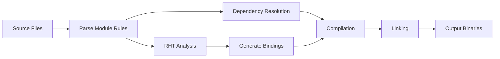

# 🔧 Build System Guide

CPP.REF는 Unreal Engine의 UnrealBuildTool에서 영감을 받은 **AylaBuildTool**이라는 커스텀 빌드 시스템을 사용합니다. 이 문서는 빌드 시스템의 구조, 사용법, 그리고 확장 방법을 설명합니다.

## 📋 목차

- [AylaBuildTool 개요](#aylabuildtool-개요)
- [빌드 시스템 아키텍처](#빌드-시스템-아키텍처)
- [명령어 레퍼런스](#명령어-레퍼런스)
- [모듈 시스템](#모듈-시스템)
- [플랫폼 지원](#플랫폼-지원)
- [프로젝트 생성](#프로젝트-생성)
- [고급 기능](#고급-기능)

## AylaBuildTool 개요

AylaBuildTool은 **.NET 9** 기반의 크로스 플랫폼 빌드 도구로, 다음 기능을 제공합니다:

- 🏗️ **모듈 기반 빌드** - Unreal Engine 스타일의 모듈 시스템
- 🎯 **증분 빌드** - 변경된 파일만 재컴파일
- 🔄 **크로스 플랫폼** - Windows, Linux, macOS 지원
- 📁 **프로젝트 생성** - Visual Studio, VSCode 프로젝트 파일 자동 생성
- 🔗 **C# 바인딩** - CoreCLR 스크립팅을 위한 자동 바인딩 생성
- ⚡ **병렬 빌드** - 멀티코어 활용한 빠른 컴파일

## 빌드 시스템 아키텍처

### 핵심 구성 요소

```
AylaBuildTool/
├── Compiler/           # 컴파일러 추상화
│   ├── CppCompiler     # C++ 컴파일러 인터페이스
│   ├── Linker          # 링커 인터페이스
│   └── SourceCodeCache # 증분 빌드 캐시
├── Installations/      # 컴파일러 설치 검색
│   ├── VisualStudio/   # MSVC 지원
│   └── GCC/            # GCC/Clang 지원
├── Projects/           # 프로젝트 모델
│   ├── Solution        # 솔루션 구조
│   ├── ModuleProject   # 모듈 프로젝트
│   └── ProgramProject  # 프로그램 프로젝트
├── Targets/            # 빌드 타겟 정의
│   ├── ModuleRules     # 모듈 빌드 규칙
│   └── TargetInfo      # 플랫폼/설정 정보
├── Generator/          # 프로젝트 파일 생성
│   ├── VisualStudio/   # VS 프로젝트 생성
│   └── VisualStudioCode/ # VSCode 설정 생성
└── RHT/                # Reflection Header Tool
    └── CodeGen/        # C# 바인딩 생성
```

### 빌드 파이프라인



## 명령어 레퍼런스

### Build 명령

프로젝트를 빌드합니다.

```bash
dotnet AylaBuildTool.dll build [options]
```

#### 옵션

| 옵션 | 짧은 형식 | 설명 | 기본값 |
|------|-----------|------|--------|
| `--project` | `-p` | 빌드할 프로젝트 파일 경로 | Engine 프로젝트 |
| `--target` | `-t` | 빌드할 타겟 모듈 이름 | 모든 모듈 |
| `--config` | `-c` | 빌드 구성 | `Shipping` |
| `--editor` | | 에디터 버전 빌드 | `false` |
| `--clean` | | 클린 정책 | `None` |
| `--generator` | `-g` | 프로젝트 생성기 | `VisualStudio` |

#### 예시

```bash
# 기본 빌드 (전체 엔진)
dotnet AylaBuildTool.dll build

# 특정 타겟만 빌드
dotnet AylaBuildTool.dll build -t Launch -c Debug

# 에디터 버전 빌드
dotnet AylaBuildTool.dll build --editor

# 게임 프로젝트 빌드
dotnet AylaBuildTool.dll build -p F:\MyGame\MyGame.uproject

# 전체 리빌드
dotnet AylaBuildTool.dll build --clean Rebuild
```

### Generate 명령

IDE 프로젝트 파일을 생성합니다.

```bash
dotnet AylaBuildTool.dll generate [options]
```

#### 옵션

| 옵션 | 짧은 형식 | 설명 | 기본값 |
|------|-----------|------|--------|
| `--project` | `-p` | 프로젝트 파일 경로 | Engine 프로젝트 |
| `--generator` | `-g` | 생성기 타입 | `VisualStudio` |

#### 지원 생성기

- `VisualStudio` - Visual Studio 2022 솔루션/프로젝트
- `VisualStudioCode` - VSCode 워크스페이스/설정

#### 예시

```bash
# Visual Studio 프로젝트 생성
dotnet AylaBuildTool.dll generate

# VSCode 워크스페이스 생성
dotnet AylaBuildTool.dll generate -g VisualStudioCode

# 게임 프로젝트 파일 생성
dotnet AylaBuildTool.dll generate -p F:\MyGame\MyGame.uproject
```

### Configuration 옵션

| Configuration | 설명 | 용도 |
|---------------|------|------|
| **Debug** | 최적화 비활성화, 디버그 심볼 포함 | 개발/디버깅 |
| **DebugEditor** | Debug + 에디터 기능 | 에디터 개발 |
| **Development** | 일부 최적화, 디버그 심볼 포함 | 프로파일링 |
| **Shipping** | 최대 최적화, 디버그 심볼 제거 | 릴리스 배포 |

### Clean 옵션

| CleanOptions | 설명 |
|--------------|------|
| **None** | 클린하지 않음 (증분 빌드) |
| **Rebuild** | 전체 리빌드 |
| **CleanOnly** | 클린만 수행 |
| **GenerateOnly** | 바인딩 생성만 수행 |

## 모듈 시스템

### 모듈 구조

CPP.REF는 Unreal Engine과 유사한 모듈 기반 아키텍처를 사용합니다.

```
MyModule/
├── Public/             # 공개 헤더 파일
│   └── MyModule.h
├── Private/            # 내부 구현 파일
│   └── MyModule.cpp
├── Script/             # C# 바인딩 프로젝트
│   └── MyModule.Script.csproj
└── MyModule.Build.cs   # 빌드 규칙 정의
```

### 모듈 빌드 규칙 (*.Build.cs)

`MyModule.Build.cs`:

```csharp
using AylaEngine;

public class MyModule : ModuleRules
{
    public MyModule(TargetInfo target) : base(target)
    {
        // 모듈 타입 설정
        Type = ModuleType.Runtime;
        
        // 공개 의존성 (Public API 노출)
        PublicDependencyModuleNames.AddRange(new[]
        {
            "Core",
            "Engine"
        });
        
        // 비공개 의존성 (내부 구현만 사용)
        PrivateDependencyModuleNames.AddRange(new[]
        {
            "RenderCore"
        });
        
        // 공개 인클루드 경로
        PublicIncludePaths.Add("Public");
        
        // 비공개 인클루드 경로
        PrivateIncludePaths.Add("Private");
        
        // 플랫폼별 설정
        if (target.Platform == PlatformGroup.Windows)
        {
            PublicDependencyModuleNames.Add("WindowsAPI");
        }
        
        // C# 스크립팅 활성화
        Script.Enabled = true;
        Script.AssemblyName = "MyModule";
    }
}
```

### 모듈 타입

```csharp
public enum ModuleType
{
    Runtime,        // 런타임 모듈 (게임에 포함)
    Editor,         // 에디터 전용 모듈
    Program,        // 독립 실행 프로그램
    ThirdParty      // 서드파티 라이브러리
}
```

## 플랫폼 지원

### 플랫폼 매트릭스

| 플랫폼 | 아키텍처 | 컴파일러 | 상태 |
|--------|----------|----------|------|
| **Windows** | x64, ARM64 | MSVC 2022+ | ✅ 완전 지원 |
| **Linux** | x64, ARM64 | GCC 11+, Clang 14+ | ✅ 완전 지원 |
| **macOS** | x64, ARM64 | Clang 14+ | 🚧 진행 중 |
| **Android** | ARM64, x64 | NDK r25+ | 📋 계획됨 |
| **iOS** | ARM64 | Xcode 14+ | 📋 계획됨 |

### 플랫폼별 설정

```csharp
public class MyModule : ModuleRules
{
    public MyModule(TargetInfo target) : base(target)
    {
        // 공통 설정
        Type = ModuleType.Runtime;
        
        // Windows 전용
        if (target.Platform == PlatformGroup.Windows)
        {
            PublicDependencyModuleNames.Add("WindowsAPI");
            PublicDependencyModuleNames.Add("Direct3D12");
            PublicDefinitions.Add("PLATFORM_WINDOWS=1");
        }
        
        // Linux 전용
        if (target.Platform == PlatformGroup.Linux)
        {
            PublicDependencyModuleNames.Add("LinuxAPI");
            PublicDependencyModuleNames.Add("VulkanAPI");
            PublicDefinitions.Add("PLATFORM_LINUX=1");
        }
        
        // Unix 계열 (Linux + macOS)
        if (target.Platform.IsUnix())
        {
            PublicAdditionalLibraries.Add("pthread");
            PublicAdditionalLibraries.Add("dl");
        }
    }
}
```

### 컴파일러별 플래그

```csharp
// MSVC
if (target.Compiler == CompilerType.MSVC)
{
    PublicCompilerFlags.Add("/std:c++20");
    PublicCompilerFlags.Add("/permissive-");
    PublicCompilerFlags.Add("/Zc:__cplusplus");
}

// GCC/Clang
if (target.Compiler.IsGnuCompatible())
{
    PublicCompilerFlags.Add("-std=c++20");
    PublicCompilerFlags.Add("-fexceptions");
    PublicCompilerFlags.Add("-frtti");
}
```

## 프로젝트 생성

### Visual Studio 프로젝트

AylaBuildTool은 다음을 자동 생성합니다:

- **솔루션 파일** (`.sln`) - 전체 프로젝트 구조
- **C++ 프로젝트** (`.vcxproj`) - 각 모듈별 프로젝트
- **C# 프로젝트** (`.csproj`) - 스크립트 바인딩 프로젝트
- **필터 파일** (`.vcxproj.filters`) - 폴더 구조

#### 생성된 구조

```
CPP.REF.sln
├── Engine/
│   ├── Core.vcxproj
│   ├── Engine.vcxproj
│   ├── RenderCore.vcxproj
│   └── ...
├── Game/
│   └── GameAssembly.vcxproj
└── Script/
    ├── Core.Script.csproj
    ├── Engine.Script.csproj
    └── ...
```

### Visual Studio Code 설정

VSCode 생성 시 다음 파일들이 생성됩니다:

#### `.vscode/tasks.json`

```json
{
  "version": "2.0.0",
  "tasks": [
    {
      "label": "Build",
      "type": "shell",
      "command": "dotnet",
      "args": [
        "Engine/Binaries/DotNET/AylaBuildTool.dll",
        "build",
        "-c", "Debug"
      ],
      "group": {
        "kind": "build",
        "isDefault": true
      }
    }
  ]
}
```

#### `.vscode/launch.json`

```json
{
  "version": "0.2.0",
  "configurations": [
    {
      "name": "Launch Game",
      "type": "cppdbg",
      "request": "launch",
      "program": "${workspaceFolder}/Engine/Binaries/Win64/Launch.exe",
      "cwd": "${workspaceFolder}",
      "MIMode": "gdb"
    }
  ]
}
```

## 고급 기능

### Reflection Header Tool (RHT)

RHT는 C++ 코드를 분석하여 자동으로 C# 바인딩을 생성합니다.

#### C++ 코드

```cpp
// MyActor.h
ACLASS()
class MyActor : public Actor
{
    GENERATED_BODY()
    
public:
    APROPERTY()
    int32 Health = 100;
    
    AFUNCTION()
    void TakeDamage(int32 Damage);
};
```

#### 생성된 C# 바인딩

```csharp
// 의사 코드
// MyActor.gen.cs
public partial class MyActor : Actor
{
    public int Health
    {
        get => get_Health__Injected(self);
        set => set_Health__Injected(self, value);
    }
    
    public void TakeDamage(int damage) => TakeDamage__Injected(self, damage);
}
```

### 증분 빌드 시스템

AylaBuildTool은 다음을 추적하여 증분 빌드를 수행합니다:

- **소스 파일 해시** - 파일 내용 변경 감지
- **의존성 그래프** - 헤더 변경 시 영향받는 파일 추적
- **컴파일러 플래그** - 빌드 설정 변경 감지
- **모듈 규칙** - `*.Build.cs` 변경 감지

#### 캐시 구조

```
Intermediate/
└── MyModule/
    └── Win64/
        └── Debug/
            ├── MyFile.cpp.o       # 오브젝트 파일
            ├── MyFile.cpp.cache   # 빌드 캐시
            └── MyFile.cpp.deps    # 의존성 정보
```

### 병렬 빌드

```csharp
// BuildRunner.cs
var compileTasks = sourceFiles
    .Select(file => Task.Run(() => CompileAsync(file)))
    .ToArray();

await Task.WhenAll(compileTasks);
```

- **파일 단위 병렬화** - 각 소스 파일을 독립적으로 컴파일
- **모듈 단위 병렬화** - 의존성이 없는 모듈 동시 빌드
- **자동 스레드 수 조정** - CPU 코어 수에 맞춰 조정

## 문제 해결

### 일반적인 문제

#### 1. "컴파일러를 찾을 수 없습니다"

```bash
# Windows: Visual Studio 설치 확인
"C:\Program Files\Microsoft Visual Studio\2022\Community\VC\Tools\MSVC"

# Linux: GCC 설치
sudo apt install build-essential

# macOS: Xcode Command Line Tools
xcode-select --install
```

#### 2. "모듈을 찾을 수 없습니다"

`*.Build.cs` 파일에서 의존성 확인:

```csharp
PublicDependencyModuleNames.AddRange(new[]
{
    "Core",      // ← 이 모듈이 존재하는지 확인
    "Engine"
});
```

#### 3. 증분 빌드 문제

캐시를 강제로 리빌드:

```bash
dotnet AylaBuildTool.dll build --clean Rebuild
```

## 성능 최적화

### 빌드 속도 향상

1. **SSD 사용** - 빌드 출력을 SSD에 배치
2. **RAM 디스크** - Intermediate 폴더를 RAM 디스크로 설정
3. **Precompiled Headers** - 공통 헤더를 PCH로 설정

## 참고 자료

- [Unreal Build Tool](https://docs.unrealengine.com/en-US/ProductionPipelines/BuildTools/UnrealBuildTool/index.html)
- [CMake Documentation](https://cmake.org/documentation/)
- [.NET Build System](https://docs.microsoft.com/en-us/dotnet/core/tools/)

---

<p align="center">
  <i>AylaBuildTool - Fast, Flexible, Cross-Platform Build System</i>
</p>
